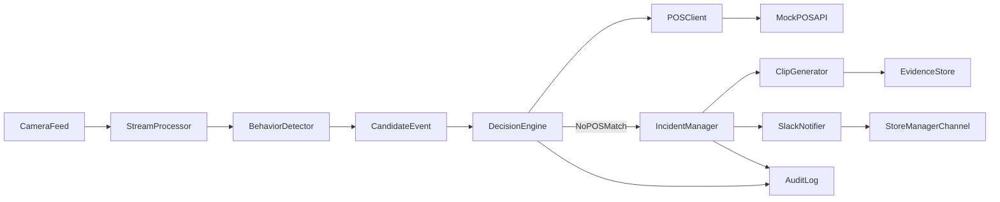

# Autonomous Retail Loss Prevention Intelligence Platform

> Agentic retail intelligence platform that combines behavioral sequence analysis, zone-aware trajectory modeling, POS validation, and explainable reasoning chains for incident decisions.

<p align="center">
  
</p>


## Project description

An end-to-end AI loss-prevention platform designed to emulate real retail operations, not just computer-vision demos. The system combines live object detection, behavioral pattern analysis, zone-aware trajectory reasoning, POS cross-checks, incident packaging, and an agentic copilot for operator guidance.

## Business outcomes this demonstrates

- Reduce false-positive alerts by validating suspicious behavior against POS signals.
- Improve response speed with auto-generated incident clips and recommended actions.
- Improve auditability with explainable reasoning chains for each decision.
- Enable frontline teams with a natural-language copilot that summarizes risk in plain terms.

## What makes this unique

Most portfolio projects stop at "object missing => alert". This platform implements three core intelligence layers:

- **Behavioral sequence engine:** tracks micro-behaviors (`lingering`, `pickup`, `look-around`, `conceal`, `move-to-exit`) and matches known theft signatures.
- **Zone intelligence engine:** classifies person trajectories across store layout zones and estimates checkout-vs-exit intent.
- **Explainable reasoning engine:** generates a step-by-step decision chain (`observation -> behavior -> zone -> POS -> confidence -> verdict`) for audit-ready transparency.

This design produces richer, lower-noise incident decisions and gives operations teams explainable evidence instead of black-box alerts.

## System architecture



## What the agent does

1. Watches webcam/video stream for suspicious concealment behavior.
2. Creates a candidate event with timestamp and confidence.
3. Queries POS scans in a configurable time window.
4. Flags mismatch between observed item behavior and scanned inventory.
5. Generates an incident-centered 5-second clip.
6. Sends a structured Slack alert with evidence and reason code.

## Production capabilities delivered

- GPU-accelerated detection pipeline (RTX-ready) with realtime overlay rendering.
- Pretrained YOLO mode for broad object classes (person, bottle, bag, phone, etc.).
- Local fine-tuning workflow for custom detector training on retail-relevant classes.
- Agentic copilot APIs for incident briefs and contextual operator Q&A.
- Human review workflow with filtering, export, and incident lifecycle controls.
- SQLite-backed persistent incident repository with retention policy controls.
- Audit timeline + evidence package per incident (clip, detector snapshot, POS correlation, reasoning chain).
- Production role policy for review/export operations and request correlation headers.

## Visual dashboard

Open `http://localhost:8080/` to access a polished operations dashboard with:
- **Command-center UI:** workspace tabs (Live / Cases / Intel), fixed right operator dock (collapsible), NVR-style feed controls (grid, fullscreen, snapshot), and enterprise dark theme
- Live camera/simulated feed with detection HUD
- **Site context:** store/camera IDs on each observation (persisted on incidents + filterable in the incident feed)
- **Pipeline control:** pause/resume vision observation posts and YOLO calls (keyboard `P`)
- **Detector tuning:** live confidence threshold slider (syncs with speed/balanced/accuracy profiles)
- Status bar: last sync time, last API **correlation ID** (support/debug), and API health
- Live object-detection overlays (bounding boxes + labels) on camera layout; confidence-colored boxes (green high / amber low), **Mirror** (preview matches inference frame), **Reticle** crosshair, and on-screen **weights name + inference latency**
- Incident metrics and real-time event stream
- Explainable reasoning chain panel (latest verdict with steps)
- Behavioral timeline (micro-behavior chips)
- Zone map + trajectory verdict + checkout/exit probability bars
- One-click advanced theft scenario simulation

## Core intelligence modules

- `src/vision/behaviors.py` - behavioral sequence analysis and theft signature matching
- `src/vision/zones.py` - zone-aware trajectory classification
- `src/vision/reasoning.py` - explainable reasoning chain generation
- `src/incidents/manager.py` - confidence fusion and incident decision lifecycle

## Tech stack

- **Core:** Python, FastAPI, Pydantic
- **Vision/data plane:** OpenCV-ready architecture, frame-stream inference loop
- **Transport:** HTTPX for POS and webhook calls
- **Quality:** Pytest, Ruff, MyPy, GitHub Actions
- **Deployment:** Docker Compose (agent + POS mock)

## Project layout

```text
autonomous-retail-loss-prevention-intelligence-platform/
  docs/
    architecture.md
  src/
    agent/main.py
    api/mock_pos_api.py
    vision/
    pos/
    incidents/
    alerts/
  tests/test_smoke.py
  docker-compose.yml
  pyproject.toml
  README.md
```

## Quick start

```powershell
python -m venv .venv
.\.venv\Scripts\Activate.ps1
pip install -e .[dev]
uvicorn src.agent.main:app --reload --port 8080
```

### GPU setup (recommended for RTX 3050)

```powershell
.\scripts\setup_gpu.ps1
```

This installs CUDA-enabled PyTorch (`cu121`) and runs YOLO inference on `cuda:0` when available.

Advanced pretrained detector:
- Default pretrained detector is **YOLOv8** (`yolov8m.pt`) with automatic fallback to other YOLOv8 sizes, then newer YOLO families if weights are missing.

### Download retail-relevant dataset assets

```powershell
python .\scripts\download_retail_relevant_data.py --sample-count 300
```

This downloads COCO validation assets and builds `data/datasets/coco/retail_relevant_val_manifest.json`
with retail-relevant classes (person, backpack, handbag, bottle, phone, etc.).

### Prepare local training dataset + train on RTX 3050

```powershell
python .\scripts\prepare_retail_yolo_dataset.py --sample-count 600 --val-split 0.2
python .\scripts\train_local_detector.py --epochs 30 --imgsz 640 --batch 16 --device 0
```

Recommended starting config for your laptop GPU:
- `model`: `yolov8n.pt`
- `imgsz`: `640`
- `batch`: `16` (drop to `8` if VRAM gets tight)
- `epochs`: `30` for baseline, `60+` for better quality

After training, point the live detector to your custom checkpoint:

```powershell
$env:DETECTOR_MODEL_PATH = "C:\Users\nikhi_d2rd8hd\runs\detect\runs\train\retail-rtx3050-run1\weights\best.pt"
$env:DETECTOR_DEVICE = "cuda:0"
uvicorn src.agent.main:app --reload --port 8080
```

Detector performance profiles in dashboard:
- `High-Speed`: lower input width, faster interval, higher confidence threshold
- `Balanced`: default profile for day-to-day use
- `High-Accuracy`: larger input width, slower interval, lower threshold for recall

Shortcuts:
- `1` -> High-Speed
- `2` -> Balanced
- `3` -> High-Accuracy

Run mock POS in another terminal:

```powershell
uvicorn src.api.mock_pos_api:app --reload --port 8081
```

Health checks:

- Agent: `http://localhost:8080/health`
- Mock POS: `http://localhost:8081/health`

Demo endpoints:
- `GET /` dashboard UI
- `POST /demo/run` run multi-stage theft scenario with zone progression
- `GET /vision/events` suspicious event stream
- `POST /vision/detect-frame` real-time object detection for UI overlay
- `GET /copilot/status` agentic copilot status (Ollama/local fallback mode)
- `GET /copilot/brief` live AI operations brief with risk + actions
- `POST /copilot/chat` ask copilot natural-language questions
- `GET /incidents` processed incident objects
- `GET /incidents/{incident_id}/evidence` export JSON evidence bundle
- `GET /metrics` dashboard counters (includes **review queue**, **POS mismatch**, **high-risk unreviewed**)
- `GET /theft/hot-spots` ranked store/camera pairs for ops (escalations + open reviews)
- `GET /metrics/extended` endpoint-latency and API config telemetry
- `GET /behavior/history` recent micro-behavior signals
- `GET /zones` store layout and zone metadata
- `GET /health` service status, `product: theft-detection`, version, capabilities
- `GET /health/dependencies` detector/copilot/dependency health details

## Agentic Copilot (Ollama + FastAPI)

The dashboard now includes an **Agentic Copilot** that explains what is happening,
estimates risk level, suggests actions, and answers operator questions.

Run in guaranteed local mode (no external API dependency):

```powershell
$env:COPILOT_PROVIDER = "local"
```

Optional local LLM mode with Ollama:

```powershell
$env:COPILOT_PROVIDER = "ollama"
$env:COPILOT_MODEL = "llama3.1:8b-instruct-q4_K_M"
$env:OLLAMA_API_URL = "http://127.0.0.1:11434"
```

If Ollama is unavailable, copilot automatically falls back to deterministic local reasoning.

## Azure hosting readiness

The repository now supports direct hosting on Azure App Service:

- Single-container Docker deployment target
- Health endpoint at `/health` for platform checks
- Environment-driven runtime config for detector + copilot

Recommended App Service startup env vars:

```text
AGENT_PORT=8080
APP_ENV=production
CORS_ALLOWED_ORIGINS=https://<your-app>.azurewebsites.net
COPILOT_PROVIDER=local
DETECTOR_PRETRAINED_MODEL=yolov8m.pt
DETECTOR_DEVICE=cpu
API_TOKEN=<strong-random-token>
```

## Essential production hardening included

- Environment-driven CORS policy (no wildcard by default)
- Optional API token guard (`X-API-Token`) for sensitive write/compute routes
- Basic per-client rate limits on heavy endpoints (`/vision/detect-frame`, `/copilot/chat`)
- Payload size guard for detection frame uploads

Sensitive routes that support API token:
- `POST /vision/detect-frame`
- `POST /incidents/{incident_id}/review`
- `POST /demo/run`
- `GET /incidents/export.csv`
- `GET /incidents/{incident_id}/evidence`

Production governance headers:
- `X-API-Token` for protected endpoints
- `X-Actor-Role` (`analyst`, `manager`, `admin`, `auditor`) for policy enforcement in non-dev environments

## Docker run

```powershell
docker compose up --build
```

## Engineering roadmap (7-day sprint)

- Day 1: project scaffold, quality gates, architecture
- Day 2: video ingestion pipeline + event schema
- Day 3: POS mock/service client + temporal correlation logic
- Day 4: decision engine state machine + incident lifecycle
- Day 5: deterministic 5-second clip generation + evidence package
- Day 6: Slack incident cards + operational hardening
- Day 7: polishing, tests, benchmark notes, and demo assets

## Validation status

- 14 automated tests passing
- Behavior engine tests (sequence matching + normal behavior rejection)
- Zone engine tests (exit/checkout trajectory classification)
- Reasoning engine tests (escalated/resolved chain generation)
- End-to-end smoke tests for API + demo scenario

## Key implementation highlights

- Multi-stage intent inference instead of single-trigger alerting
- Spatially aware trajectory analysis tied to business outcomes
- Explainable, auditable decision narratives for each incident
- Premium interactive UI for live monitoring, debugging, and demo storytelling
