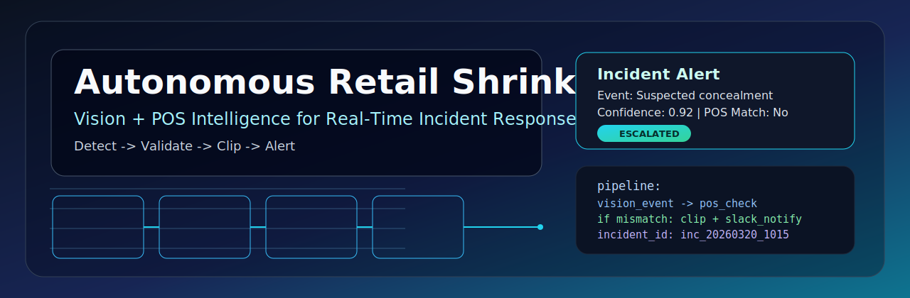
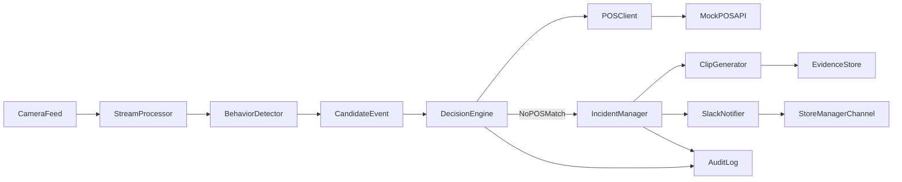

# Autonomous Retail Shrinkage Agent

> Agentic computer vision system that detects suspicious retail behavior, validates against POS data, and autonomously escalates with evidence.

<p align="center">
  
</p>


## Why this stands out on a resume

Most CV demos stop at detection. This project demonstrates **decision intelligence**:
- Vision signal -> behavioral anomaly candidate
- Business verification -> POS cross-check
- Autonomous action -> evidence clipping + alerting
- Operational quality -> structured logging, testing, and reproducible deployment

It showcases the exact blend hiring teams look for in ML engineers: **model-aware systems design + backend reliability + product thinking**.

## System architecture



## What the agent does

1. Watches webcam/video stream for suspicious concealment behavior.
2. Creates a candidate event with timestamp and confidence.
3. Queries POS scans in a configurable time window.
4. Flags mismatch between observed item behavior and scanned inventory.
5. Generates an incident-centered 5-second clip.
6. Sends a structured Slack alert with evidence and reason code.

## Tech stack

- **Core:** Python, FastAPI, Pydantic
- **Vision/data plane (next build steps):** OpenCV, FFmpeg
- **Transport:** HTTPX for POS and webhook calls
- **Quality:** Pytest, Ruff, MyPy, GitHub Actions
- **Deployment:** Docker Compose (agent + POS mock)

## Project layout

```text
autonomous-retail-shrinkage-agent/
  docs/
    architecture.md
  src/
    agent/main.py
    api/mock_pos_api.py
    vision/
    pos/
    incidents/
    alerts/
  tests/test_smoke.py
  docker-compose.yml
  pyproject.toml
  README.md
```

## Quick start

```powershell
python -m venv .venv
.\.venv\Scripts\Activate.ps1
pip install -e .[dev]
uvicorn src.agent.main:app --reload --port 8080
```

Run mock POS in another terminal:

```powershell
uvicorn src.api.mock_pos_api:app --reload --port 8081
```

Health checks:

- Agent: `http://localhost:8080/health`
- Mock POS: `http://localhost:8081/health`

## Docker run

```powershell
docker compose up --build
```

## Engineering roadmap (7-day sprint)

- Day 1: project scaffold, quality gates, architecture
- Day 2: video ingestion pipeline + event schema
- Day 3: POS mock/service client + temporal correlation logic
- Day 4: decision engine state machine + incident lifecycle
- Day 5: deterministic 5-second clip generation + evidence package
- Day 6: Slack incident cards + operational hardening
- Day 7: polishing, tests, benchmark notes, and demo assets

## Recruiter-friendly impact bullets

- Built an **agentic CV + transaction intelligence** pipeline that escalates only business-relevant anomalies.
- Designed a **multi-signal decision engine** to reduce false positives using POS cross-validation.
- Implemented **automated incident evidence capture** and alert delivery for near real-time operational response.
